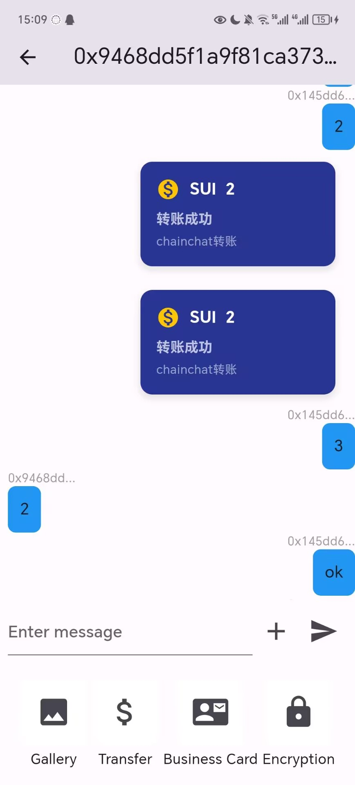
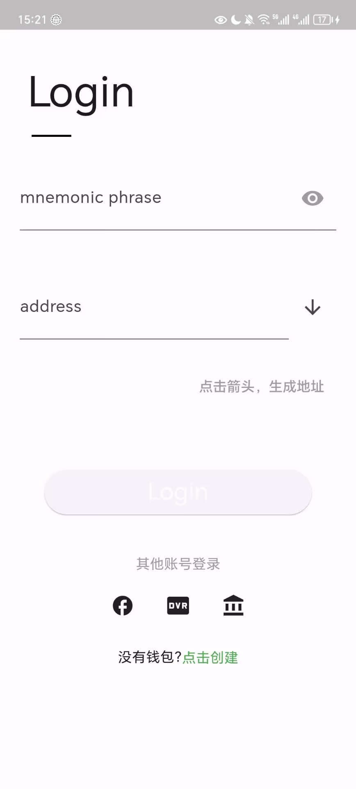

# chainchat
Chainchat is a decentralized chat application built on the SUI blockchain, natively supporting cryptocurrencies. It also serves as a Web3 ecosystem aggregator, where you can discover various outstanding projects in the "Discover" section, including Bridges, DeFi, DEXs, NFTs, and tools. As an experimental feature, chatting on Chainchat earns you CHAT tokens.

# Chainchat's on-chain code
```move
module chainchat::chat_coin {
    use std::string;
    use sui::object::{Self, UID};
    use std::option;
    use sui::coin;
    use sui::transfer;
    use sui::tx_context::TxContext;
    use sui::clock::Clock;
    use sui::event;

    /// The type identifier of coin. The coin will have a type
    /// tag of kind: `Coin<package_object::mycoin::MYCOIN>`
    /// Make sure that the name of the type matches the module's name.
    public struct CHAT_COIN has drop {}

    public struct Wrap has key,store{
        id: UID,
        treasury: coin::TreasuryCap<CHAT_COIN>,
    }
    public struct Cryptotransfer has key,store{
        id:UID,
        text:string::String,
        from:address,
        to:address,
        crypto:string::String,
        amount:string::String,
        timestamp_ms:u64,
    }
    
     
    public struct Message has key, store {
        id: UID,
        text: string::String,
        from: address,
        to: address,
        timestamp_ms:u64,
    }
    public struct Limit has key,store{
        id: UID,
        count: u64,
    }

    public struct Admin has key,store{
        id: UID,
        address: address,
    }
    

    public entry fun send_message(wrap: &mut Wrap ,limit:&mut Limit,text: vector<u8>, addr: address, clock: &Clock,ctx: &mut TxContext) {
          let object = Message {
            id: object::new(ctx),
            from: tx_context::sender(ctx),
            to: addr,
            text: string::utf8(text),
            timestamp_ms:clock.timestamp_ms()
        };
        transfer::transfer(object, addr);
        limit.count =limit.count + 1;
        if(limit.count < 1000000){
        mint(&mut wrap.treasury, 1000000000, ctx);
        }
        //TODO:mint chat coin to addr
    }
    public entry fun crypto_transfer(text:vector<u8>,addr:address,crypto:vector<u8>,amount:vector<u8>,clock:&Clock,ctx:&mut TxContext){
        let object2 = Cryptotransfer {
            id: object::new(ctx),
            from:tx_context::sender(ctx),
            to:addr,
            text:string::utf8(text),
            crypto:string::utf8(crypto),
            amount:string::utf8(amount),
            timestamp_ms:clock.timestamp_ms()
        };
        transfer::transfer(object2, addr);
    }

    /// Module initializer is called once on module publish. A treasury
    /// cap is sent to the publisher, who then controls minting and burning

    fun init(witness: CHAT_COIN, ctx: &mut TxContext) {
        let (treasury, metadata) = coin::create_currency(witness, 9, b"CHAT", b"CHAT", b"", option::none(), ctx);
        transfer::public_freeze_object(metadata);
        let wrap = Wrap {
            id: object::new(ctx),
            treasury: treasury,
        };
        transfer::share_object(wrap);
        let admin = Admin{
            id: object::new(ctx),
            address: tx_context::sender(ctx),
        };
        transfer::transfer(admin, tx_context::sender(ctx));
        let limit = Limit{
            id: object::new(ctx),
            count: 0,
        };
        transfer::share_object(limit);

        
        
    }

    /// Function to mint new CHAT_COIN tokens
    fun mint(treasury: &mut coin::TreasuryCap<CHAT_COIN>, amount: u64, ctx: &mut TxContext) {
        let coin = coin::mint<CHAT_COIN>(treasury, amount, ctx);
        transfer::public_transfer(coin, tx_context::sender(ctx));

    }

}
```

# Simple Display
Wallet:

Discover:

Friends:

Homepage:

Chatpage:

LoginPage:
Enter your mnemonic phrase and then click the down arrow to populate the address.


